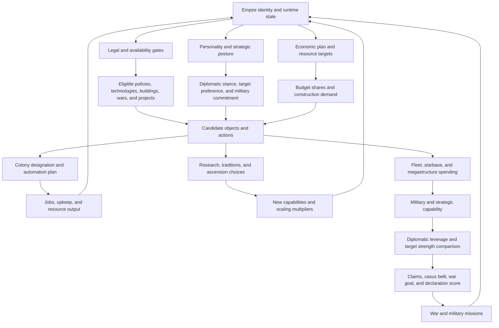

# Stellar AI Director AI Control Web

Status: working reference for Stellaris 4.4.4 runtime compatibility and 4.4.5-targeted development  
Last updated: 2026-07-10  
Scope: economy, construction, colony specialization, research, diplomacy, war, fleets, expansion, ascension, megastructures, crises, and special empire archetypes

## Purpose

Stellaris AI behavior is not controlled by one priority list. It is a connected decision system in which eligibility gates, strategic targets, budgets, colony plans, object scores, personality fields, diplomatic state, and runtime military logic all have to agree.

This guide maps those connections so a change in one subsystem is reviewed for its effects on every downstream subsystem. It also establishes a diagnostic order: find the first false hard gate before tuning later multipliers.

## The central control loop



The important property is feedback. For example, naval-cap demand can select fortress infrastructure; fortress infrastructure consumes a colony opportunity; the lost research or alloy output slows scaling; the weaker economy changes fleet affordability and target strength; that can prevent war even when personality aggression is high.

## Five kinds of controls

Every AI lever must be classified before it is changed.

| Control class | Typical surfaces | Meaning | Failure pattern |
|---|---|---|---|
| Hard gate | `potential`, `allow`, `possible`, prerequisites, policy flags, scope checks | Determines whether an option exists at all | A multiplier cannot revive a gated-out option |
| Route or state selector | scripted triggers, flags, variables, country state, game phase | Chooses the strategic context | An overly broad state can hold most empires in one posture indefinitely |
| Target or budget allocator | economic plans, `ai_budget`, personality spending | Determines what resources are sought and reserved | Competing targets can double-allocate income or starve another category |
| Candidate scorer | `ai_weight`, `weight_modifier`, `ai_resource_production`, designation affinity | Ranks options that already passed gates | Extreme values can overwhelm opportunity cost and create monocultures |
| Runtime executor | engine diplomacy, war planner, fleet missions, colony automation, market logic | Performs the selected action | Static script can look correct while runtime scope or engine state blocks execution |

The core rule is:

> Eligibility is multiplicative. If any required hard gate is false, later pressure is effectively multiplied by zero.

## Source-of-truth order

1. Current user strategic requirements.
2. Current local Stellaris 4.4.4 files for runtime behavior.
3. Current 4.4.5 files when available for forward-port differences.
4. The active launcher playset and final load-order winners.
5. Stellar AI Director generated output and generator source.
6. Current Stellar AI as a behavioral reference, not a dependency.
7. Runtime save and log evidence.
8. Historical documentation or inference.

Stellar AI Director currently loads last in the active playset. Full-object overrides therefore carry responsibility for preserving the complete current vanilla or parent-mod object contract.

## Cross-system control matrix

| Domain | Primary inputs | Primary consumers | Direct effect | Major downstream ripples |
|---|---|---|---|---|
| Empire archetype | ethics, civics, authority, origin, gestalt type, crisis state | personalities, policies, tech/AP weights, diplomacy | Establishes legal and strategic identity | Changes war goals, economy, diplomacy, pop model, and acceptable risk |
| Strategic state | war, peace, boxed-in state, colony access, deficits, fleet losses, crisis threat | scripted triggers and route selectors | Chooses active priorities | Can change every budget, designation, stance, and project score |
| Personality | `aggressiveness`, `bravery`, `military_spending`, behavior flags | diplomacy and war planner | War willingness, target strength tolerance, military allocation | More spending can create deficits; more bravery can cause suicides; behavior flags change target type |
| Diplomatic stance | policy availability and AI weight | opinion, border friction, influence, envoys, target relationships | Alters relationship formation and expansion posture | Cooperative bias can remove rivals and hostile targets before war scoring occurs |
| Economic plan | base plan plus eligible subplans | resource target system | Defines desired surplus and focus resources | Drives construction demand, technology affordability, fleet rebuilding, and megastructure readiness |
| AI budget | resource, expenditure/upkeep type, category, weight, desired min/max | purchasing and construction categories | Allocates available resources | Competing minima can reserve the same resources; military and starbase shares can crowd out research economy |
| Colony designation | planet properties, empire needs, designation weights, Director flags | colony automation | Selects a build-out plan and modifiers | A wrong designation produces the wrong zones, districts, buildings, jobs, and upkeep |
| Colony automation | designation availability, priority districts/zones/buildings | planet construction executor | Supplies the ordered build candidates | Research worlds build research zones; fortress worlds build fortress zones and strongholds |
| Global construction defines | deficit/focus/resource/naval-cap multipliers, free-job caps, thresholds | generic construction scorer | Rescales candidate scores globally | High naval-cap scoring can invade research/economic opportunity; low thresholds accept weak candidates |
| Technology weights | availability, prerequisites, tier, area, category, strategic route | research choice | Selects unlock path | Missing economy for researcher upkeep makes nominal research pressure self-defeating |
| Traditions and ascension | availability, unity, completed trees, perks, empire type | long-horizon strategy | Adds multipliers and unlocks | Can redirect diplomacy, war, megastructures, species model, and resource demand |
| Fleet doctrine | designs, components, ship roles, naval cap, budgets, threat | ship construction and military missions | Converts alloys into usable power | Invalid designs or missing resources make military spending ineffective |
| Expansion | influence, construction ships, reachable systems, hostile fauna, claims | starbase and diplomacy systems | Acquires peaceful or hostile growth space | Failure increases boxed-in pressure; loops waste influence, time, and construction capacity |
| War declaration | legal policy, target relationship, CB, war goal, target score, personality | engine war planner | Starts a war | War changes budget restraint, fleet missions, economy, threat, opinion, and reconstruction needs |
| Megastructures | tech/AP prerequisites, placement, budget, construction capacity | megastructure planner | Converts large stockpiles into scaling assets | Competes with fleet replacement and starbases but can relieve long-term resource constraints |
| Crisis/boss response | threat class, known power, fleet concentration, defeat memory | military missions | Chooses whether and how to engage | Must be isolated from normal-empire war confidence to prevent either passivity or suicides |
| Market and overflow | stockpile, income, capacity, deficit duration | emergency market logic | Prevents resource zero or cap waste | Market dependence can conceal structural deficits and drain other resources |

## Economy web

### Economic plans

Vanilla 4.4 economic plans are additive. Base-plan entries with the same ID merge; same-name subplans overwrite; other same-name information generally overwrites. A full file overwrite is required to replace the complete plan.

Key semantics:

- `income` is a desired surplus target.
- `focus` increases priority until the target is reached.
- eligible subplan goals add to the base plan.
- multiple subplans may be active at once.
- `scaling_subplan` can add repeatedly while its conditions pass.
- subplan `ai_weight` is not added to the parent plan.

Cascade risk: several individually reasonable subplans can demand the same minerals, energy, consumer goods, or alloys simultaneously. The result can be an impossible plan that keeps all construction in permanent catch-up mode.

### AI budgets

An AI budget entry chooses a resource, expenditure or upkeep type, and an economic category. The category must exist and use `use_for_ai_budget = yes`.

- `weight` is a relative fraction, not an absolute amount.
- actual share is the entry weight divided by the sum of competing weights.
- `desired_min` and `desired_max` are guidelines.
- excessive minima can double-allocate the same stockpile.
- competing maxima may prevent any one category from reaching its target.

Personality `military_spending` changes the surrounding military commitment. It must be reviewed with alloy, energy, strategic-resource, ship, army, starbase, and megastructure budget entries.

### Relative resource standards

Targets must scale with liabilities and empire size rather than using one flat income number.

Conceptual target:

```text
required income = civilian upkeep
                + fleet and starbase upkeep
                + planned construction throughput
                + expected replacement throughput
                + growth margin
```

Alloys require replacement throughput, not a giant idle reserve. Food can remain near balanced when its main role is maintenance. Consumer goods require a stronger safety margin because a deficit throttles research and other specialist output.

### Shortage priority

1. Mild shortage above a two-month buffer: add structural income and avoid new upkeep in that resource.
2. Resource at or near zero: use emergency purchases only to preserve roughly two months while structural repair runs.
3. Persistent failure: reduce liabilities, including unnecessary fleet or buildings, and end or de-escalate costly commitments when possible.
4. Deep death spiral: treat asset reduction as last resort; do not normalize market dependency.

### Overflow priority

1. Spend on a high-value strategic goal.
2. Spend on a lower-priority speculative goal.
3. Trade surplus diplomatically for a needed resource when available.
4. Increase storage when the investment is efficient.
5. Sell unavoidable overflow before the cap destroys 100 percent of marginal income.

The top buffer should be approximately two months of income, not a one-year delay at the storage cap.

## Colony specialization and construction web

### Designation is a plan selector

In 4.4, a colony designation is not merely a production modifier. It selects which colony-automation object becomes available.

Examples from current vanilla 4.4.4:

- `has_research_designation = yes` enables `automate_research_planet`.
- `has_fortress_designation = yes` enables `automate_fortress_planet`.
- `col_city`, `col_hive`, and `col_nexus` enable urban automation.

Research automation prioritizes research zones and research-support buildings. Fortress automation prioritizes fortress zones, military infrastructure, planetary shields, and strongholds. Urban automation prioritizes trade zones and commercial buildings.

Therefore, a wrong designation is not a cosmetic mistake. It redirects the entire build queue.

### Plans and weights are both real

The correct model is not “plans instead of weights.” It is:

```text
designation eligibility and score
    -> selected colony automation plan
    -> ordered district/zone/building candidates
    -> candidate availability and object scoring
    -> global deficit/focus/resource/naval-cap multipliers
    -> budget and affordability checks
    -> construction
```

Plans constrain and order the candidate family. Weights and global scoring still decide among eligible candidates and can distort the plan when a cross-cutting score is extreme.

### Current Director research commitment

The Director uses `staid_research_plan_claimed` to prevent an AI research colony from falling back to generic Urban designation. The intended normal-empire schedule is:

- one research colony at three colonies;
- two at five colonies;
- three at six colonies;
- thereafter maintain approximately a 50 percent research-colony ratio;
- deviate only when the economy cannot support researcher upkeep or an explicit archetype strategy requires it.

Current runtime evidence shows the event that maintains this flag has colony-versus-planet scope errors. This is a hard-gate failure: the designation override can be correct while the flag that makes it eligible is never set. The generic validator must cover owned-colony iterators and their required `planet = { ... }` scope transitions.

### Fortress world contract

Fortress worlds are late or context-specific infrastructure, not an opening default.

Minimum strategic gates:

- never consume one of the first five non-capital colony roles for a normal empire;
- do not select while core energy, alloys, consumer goods, research, minerals, or food are structurally unsafe;
- prefer actual defensive geography or a protected-asset screen when the engine exposes a reliable proxy;
- require valuable colonies or infrastructure behind the defensive position;
- suppress during negative alloy income or unaffordable fleet upkeep;
- do not build naval capacity merely because naval capacity has a high generic score.

### High-risk current global construction values

Current Director versus vanilla 4.4.4:

| Define | Director | Vanilla | Cross-system risk |
|---|---:|---:|---|
| `AI_DEFICIT_SCORE_MULT` | 500 | 100 | Deficit response can overwhelm long-term specialization |
| `AI_FOCUS_SCORE_MULT` | 12 | 2 | Focus resources can monopolize construction |
| `AI_RESOURCE_PRODUCTION_SCORE_MULT` | 8 | 1 | Generic producers can crowd out utility and plan-specific infrastructure |
| `AI_NAVAL_CAP_SCORE_MULT` | 25 | 15 | Naval-cap buildings can invade valuable colony slots |
| `BUILDING_BUILD_THRESHOLD` | 0.1 | 1 | Weak candidates become buildable |
| `UNDERDEVELOPED_PLANET_LIMIT` | 999 | 3 | AI can spread construction across many unfinished colonies |
| `AI_FREE_JOBS_DISTRICT_BUILD_CAP` | 2000 | 200 | Permits more speculative district construction |
| `AI_FREE_JOBS_BUILDING_BUILD_CAP` | 5000 | 1000 | Permits more speculative building construction |

These are global multipliers. They must be treated as last-mile tuning after designation plans, economic targets, and affordability are correct.

## Research, traditions, and ascension web

Research scaling requires all of the following:

1. research-designated colonies;
2. research zones, districts, buildings, and fillable jobs;
3. enough consumer goods, energy, amenities, housing, and strategic resources;
4. technology weights that advance prerequisite chains rather than isolated end technologies;
5. unity and tradition choices that unlock useful ascension paths;
6. ascension perks that match the empire's actual route and available content;
7. megastructure and ship-component follow-through so unlocks become productive assets.

Technology weight cannot solve a missing prerequisite, unavailable object, invalid scope, unaffordable researcher upkeep, or absent research colony.

Ascension selection must be archetype-aware:

- machine, hive, biological, synthetic, psionic, cybernetic, and crisis routes have different legal trees;
- genocidal empires should prefer conquest and military scaling but still require a viable research/economy base;
- megastructure perks should require realistic prerequisite and construction-resource paths;
- diversity should come from explicit viable archetype models, not random economically self-destructive choices.

## Diplomacy and war web

### War-declaration gate chain

A normal war requires the following chain:

1. The country can conduct diplomacy and war.
2. Its real `war_philosophy` policy permits an applicable war.
3. A target relationship exists: negative attitude, rivalry, threat, claims, border friction, or an archetype-specific enemy relationship.
4. A legal casus belli exists.
5. A selectable war goal exists.
6. The target passes strength, distance, desirability, and strategic-value checks.
7. Personality and global aggression make declaration likely enough.
8. Fleet readiness and military missions can execute the war after declaration.

Do not tune step 7 until steps 1 through 6 are proven in the save. A galaxy can have extreme aggression values and still remain at peace because no target reaches the declaration scorer.

### Personality fields and their cascades

Current vanilla comments establish:

- `aggressiveness` affects declaration chance, insults, and the fraction of fleet committed to offense;
- `bravery` affects willingness to choose similarly strong or stronger rivals and war targets;
- `military_spending` affects naval and army resource commitment;
- `colony_spending` affects colony resource commitment;
- behavior flags such as `conqueror`, `subjugator`, `liberator`, `opportunist`, `propagator`, and `sneak_attacker` affect target and action preferences;
- pact-acceptance values directly alter diplomatic acceptance;
- threat and border-friction modifiers change how relationships evolve.

This means personality changes simultaneously affect economy, diplomacy, fleet use, and war. They are not isolated military settings.

### Diplomatic stance cascade

Diplomatic stance affects influence, border friction, envoys, relationship improvement, diplomatic acceptance, and the population of hostile targets.

A strong Cooperative bias can produce this chain:

```text
research/economic route
    -> Cooperative stance
    -> lower border friction and better relations
    -> fewer rivalries and hostile attitudes
    -> fewer claims and legal/desirable targets
    -> aggressiveness never receives a target
    -> no war despite a dominant fleet
```

The Director previously had a broad research-under-curve multiplier on Cooperative stance. That specific broad trigger has been removed, but the full-object `diplomatic_stance` override remains a high-risk integration surface and must be compared field-for-field against both 4.4.4 and 4.4.5.

### Current war-pressure settings

Current Director values are already far more permissive than vanilla for base aggression, boxed-in pressure, preparation time, declaration floor, and offensive fleet allocation. `ENEMY_FLEET_POWER_MULT = 0.55` is intentionally retained for wars against normal empires.

The continued no-war galaxy therefore points first to an upstream gate or target-generation failure, not insufficient final aggression.

### Boxed-in pressure

Boxed-in state should alter several systems together:

- reduce peaceful expansion spending that has no valid target;
- increase claim and conquest-route value;
- prefer Belligerent, Supremacist, or archetype-appropriate hostile stance;
- preserve enough alloys and energy to use the existing fleet;
- select nearby weak targets with colonies, chokepoints, or reconnection value;
- avoid replacing productive colonies with fortress worlds merely because naval capacity is valued.

The trigger must prove an actual legal target, not just raise a global aggression multiplier.

## Fleet, fauna, boss, and crisis web

### Normal empires versus space fauna

Normal-empire war confidence and hostile-fauna confidence are separate problems.

- Keep normal enemy fleet valuation permissive enough for wars.
- Clear weak fauna and mining fleets when the fleet advantage is safe and the system unlocks useful territory.
- Treat skull/boss entities through dedicated boss thresholds and fleet concentration.
- Do not use boss thresholds for ordinary fauna or normal empires.

### Defeat escalation

After a failed boss engagement, the AI should not repeat the same understrength mission. The response ladder is:

1. record the failed target class and approximate committed power;
2. block immediate retry;
3. require a materially larger concentrated force;
4. escalate again after another failure;
5. expire or reduce the memory only after sufficient time or a major capability change.

Generic backoff prevents loops; target classification prevents unnecessary passivity.

### Fleet investment contract

Fleet spending is productive only when at least one use exists:

- credible war preparation;
- active war reinforcement;
- crisis or boss response;
- defense against a plausible threat;
- fauna clearance that opens valuable territory.

Otherwise, negative alloy income plus continued fleet and naval-cap construction is an economy bug, not prudent defense.

## Expansion and retry-loop web

Construction-ship expansion requires:

- a legal and reachable system;
- no hidden hostile, event, ownership, or pathing gate;
- enough influence and alloys;
- a valid starbase order;
- a retry state that distinguishes transient failure from permanent rejection.

For repeated failure:

1. identify the engine rejection or system state when possible;
2. classify known special systems with targeted handlers;
3. apply exponential or stepped backoff to unknown failures;
4. release the construction ship to another valid target;
5. retain a bounded retry memory so save growth and permanent abandonment are avoided.

## Archetype overlays

The base strategy is research-led economic scaling. Archetypes modify it; they do not bypass economic viability.

| Archetype | Strategic overlay | Required guardrails |
|---|---|---|
| Normal empire | Research ratio, balanced economy, opportunistic expansion and war | Consumer-goods support and legal target chain |
| Militarist/hegemon | Earlier alloys, claims, fleet, and conquest conversion | Must use fleet; suppress fortress/naval-cap excess during alloy deficit |
| Fanatic purifier/exterminator/swarm | Total-war target generation, high military commitment | Preserve research and replacement income; separate boss logic |
| Machine intelligence | Energy/mineral/alloy and assembly model; no organic CG/food assumptions | Civic-specific upkeep and assembly gates |
| Hive mind | Food/mineral/alloy and growth model; gestalt diplomacy limits | No invalid specialist or consumer-goods assumptions |
| Rogue servitor | Machine economy plus bio-trophy requirements | Amenities, organic upkeep, and sanctuary capacity |
| Assimilator | Conquest-to-pop-growth route | Army, occupation, assimilation, and stability throughput |
| Pacifist/inward perfection | Legal defensive/tall/research path | Do not fabricate illegal wars; invest in habitats/megastructures when boxed in |
| Megacorp | Trade, branch offices, diplomacy, and selective war | Avoid generic Urban worlds without profitable trade context |
| Crisis aspirant | Extreme military and crisis progression | Very high bravery only with fleet concentration and sustainable replacement |
| Fallen/awakened/special country | Preserve special scripts and economies | Exclude from normal plan assumptions unless explicitly supported |
| Nomad/Arkship | 4.4 carrier, wayline, and mobile-economy model | Separate colony, expansion, and automation assumptions |

## Failure-mode matrix

| Symptom | First gates to inspect | Likely third-order cause | Do not do first |
|---|---|---|---|
| No wars galaxy-wide | war policy, hostile target, rivalry/claims, CB, war goal, personality winner | Cooperative stance or pact network removes targets | Raise global aggression again |
| Dominant empire does not attack weak neighbor | target attitude, legal CB/goal, distance, subject/federation protection | diplomacy and claims never create a target | Force `declare_war` by event |
| Fortress world among first colonies | designation eligibility, fortress hard gates, naval-cap score | generic naval-cap pressure overwhelms colony opportunity | Only reduce stronghold building weight |
| No research worlds | research claim flag, colony/planet scope, designation potential | runtime event never sets the plan state | Only increase research building weight |
| Urban-world spam | research/economic designation availability and scores | generic fallback remains eligible while intended plan is gated out | Add more urban buildings |
| Negative alloys while building fleet | military spending, ship budget, war/crisis use state, alloy plan | fleet target lacks an affordability or usefulness exit | Add market purchases |
| Consumer-goods deficit throttles research | CG income target, researcher upkeep, factory designation, trade policy | research expansion is not coupled to support economy | Suppress research globally |
| Construction ship loops on one system | system rejection, hidden hostiles/event, retry memory | no per-target failure state or backoff | Globally disable expansion |
| Fleets suicide into bosses | target classification, boss threshold, concentration, defeat memory | normal hostile-fleet confidence applied to boss | Raise normal enemy multiplier |
| AI ignores weak fauna blocking colonies | fauna class, hostile-fleet distance, mission generation | boss caution applied to all fauna | Lower all boss thresholds |
| Huge idle stockpile at cap | spending eligibility, diplomatic trade, storage, overflow sale | long grace period destroys marginal income | Hold one-year cap buffer |
| Market dependence | structural income, liabilities, emergency duration | purchases mask a permanent deficit | Treat market income as stabilization |

## Change-impact checklist

Before changing any AI lever, record:

1. What hard gate makes the object or action eligible?
2. Which scope evaluates the gate at runtime?
3. Which route or state activates the preference?
4. Which budget pays cost and upkeep?
5. Which economic-plan targets support it?
6. Which colony designation and automation plan can construct it?
7. Which technologies, traditions, perks, policies, civics, or DLC unlock it?
8. Which personality or archetype should use it?
9. What economy, diplomacy, war, research, construction, and fleet ripples follow?
10. What condition turns the pressure off?
11. What competing option is displaced?
12. What save and runtime-log evidence proves execution?

## Validation order

1. Confirm active playset and load-order winner.
2. Validate generated script syntax and object references.
3. Compare full-object overrides against current 4.4.4 and target 4.4.5 definitions.
4. Check runtime logs for scope and invalid-object errors.
5. Inspect a save for the first false hard gate.
6. Confirm the chosen policy, designation, plan, budget, and personality in runtime state.
7. Observe the resulting action, not just the presence of a score or flag.
8. Add a generic static regression test for each newly discovered crash or invalid-scope pattern.
9. Use observer runs for strategic outcomes; do not encode fast-changing target numbers as static pass/fail tests.

## Current high-priority audit findings

1. The no-war problem is upstream of the already-extreme global aggression defines. The next save audit must identify whether target relationship, claims, legal CB, selectable war goal, or active personality is the first false gate.
2. The research-colony commitment currently has runtime colony-versus-planet scope errors in the monthly maintenance event. This prevents the planned specialization ratio from being reliable.
3. Global construction multipliers are strong enough to undermine designation intent, especially naval-cap scoring and permissive building thresholds.
4. The full diplomatic-stance override is a broad integration surface whose relationship effects can suppress target generation.
5. Personality changes must be evaluated together with military budgets and economic affordability; higher aggressiveness and military spending are not independent.
6. Fortress selection needs colony-count, economic-safety, and defensive-value gates before its automation plan becomes available.

## Primary evidence anchors

- `C:/Steam/steamapps/common/Stellaris/common/ai_budget/documentation.txt`
- `C:/Steam/steamapps/common/Stellaris/common/economic_plans/00_example.txt`
- `C:/Steam/steamapps/common/Stellaris/common/personalities/00_personalities.txt`
- `C:/Steam/steamapps/common/Stellaris/common/colony_automation/00_research_automation.txt`
- `C:/Steam/steamapps/common/Stellaris/common/colony_automation/00_fortress_automation.txt`
- `C:/Steam/steamapps/common/Stellaris/common/colony_automation/00_urban_automation.txt`
- `C:/Steam/steamapps/common/Stellaris/common/defines/00_defines.txt`
- `mods/StellarAIDirector/common/defines/zzzz_staid_14_high_scale_ai_defines.txt`
- `mods/StellarAIDirector/common/personalities/zzzzz_staid_16_standalone_war_pressure.txt`
- `mods/StellarAIDirector/common/policies/zzzz_staid_10_opening_growth_policies.txt`
- `mods/StellarAIDirector/common/economic_plans/zzzz_staid_additive_economic_plan.txt`
- `mods/StellarAIDirector/common/colony_types/zzzzz_staid_16_research_buildout_plan.txt`
- `mods/StellarAIDirector/common/colony_types/zzzzz_staid_15_fortress_economic_hard_gates.txt`
- `mods/StellarAIDirector/notes/stellar_ai_director_strategy_hypothesis_2026-07-08.md`
- `research/webchatgpt/stellaris-ai-war-research-packet-2026-07-09/`

## Maintenance rule

Every new strategic failure must update this guide in three places:

1. the relevant control-web connection;
2. the failure-mode matrix;
3. the validation or regression-test rule that would detect recurrence.

The guide is not complete merely because every file surface is listed. It is complete only when each important lever has an upstream gate, a downstream consumer, a shutoff condition, and cross-domain cascade notes.

## Raw findings ledger

This appendix intentionally preserves incomplete and possibly wrong working conclusions. Each item is labeled so future work can verify rather than silently rediscover it.

### Confirmed from the active environment

- The runtime game version in the latest inspected crash was Stellaris 4.4.4.
- The Director descriptor targets `v4.4.*`, so the launcher accepts both 4.4.4 and 4.4.5.
- The active playset contains 116 enabled mods.
- Stellar AI is not installed or enabled.
- Stellar AI Director is the last active mod and points directly to this repository source.
- Gigastructural Engineering, Planetary Diversity, ESC NEXT, and NSC3 load before the Director.
- A historical conflict dataset still contains Stellar AI and an older Director load position; it is stale and must not be treated as the current playset.
- The current Director contains 142 indexed files and approximately 6,273 indexed script/document sections.
- Director surface families currently include budgets, ascension perks, bombardment stances, buildings, colony types, decisions, defines, districts, economic plans, edicts, federation types, inline scripts, megastructures, on-actions, opinion modifiers, personalities, policies, scripted effects/modifiers/triggers/values/variables, ship behaviors/sizes, starbase buildings/modules, static modifiers, technology, traditions, and events.
- The current local 4.4.4 control-surface index contains 487 selected vanilla files and approximately 25,036 sections.
- The Director has a full-object `diplomatic_stance` policy override, not a small additive fragment.
- The Director has twenty explicit personality object overrides: `honorbound_warriors`, `evangelising_zealots`, `erudite_explorers`, `spiritual_seekers`, `ruthless_capitalists`, `hegemonic_imperialists`, `slaving_despots`, `democratic_crusaders`, `harmonious_hierarchy`, `federation_builders`, `fanatic_purifiers`, `hive_mind`, `devouring_swarm`, `migrating_flock`, `machine_intelligence`, `assimilators`, `exterminators`, `servitors`, `fanatic_befrienders`, and `became_the_crisis`.
- The Director does not use a scripted forced-war fallback and should not add one as a substitute for repairing normal engine decisions.
- `ENEMY_FLEET_POWER_MULT` is currently `0.55` and is intentionally aimed at normal-empire war execution.
- Boss thresholds are currently `100000` and `500000`; vanilla 4.4.4 values are `40000` and `100000`.
- `AI_HOSTILE_FLEET_DISTANCE` is currently `3`; vanilla is `1`.
- The latest runtime log contains nine Director-owned wrong-scope errors in the research-plan maintenance path. The engine reports current scope `colony` while `has_planet_flag`, `set_planet_flag`, `remove_planet_flag`, and the research-candidate trigger require `planet` scope.
- The current research designation override itself uses `planet = { ... }` wrappers correctly; the failing path is the event/iterator maintenance path.
- The current game did not repeat the native crash after the duplicate Stellaris instance was closed. The duplicate-instance explanation is strongly supported by the A/B result but was not explicitly named by the crash log.

### Current personality pressure values

| Personality | Aggressiveness | Bravery | Military spending | Working interpretation |
|---|---:|---:|---:|---|
| Honorbound warriors | 4.0 | 1.0 | 1.5 | Very aggressive conqueror |
| Evangelising zealots | 3.0 | 0.9 | 1.5 | Aggressive ideological/conquest route |
| Erudite explorers | 1.8 | 0.85 | 1.2 | Research-oriented but still war-capable |
| Spiritual seekers | 0.5 | 0.5 | 1.2 | Intentionally restrained |
| Ruthless capitalists | 3.0 | 0.9 | 1.5 | Opportunistic economic aggressor |
| Hegemonic imperialists | 2.5 | 0.9 | 2.0 | Subjugation and conquest emphasis |
| Slaving despots | 2.5 | 0.9 | 2.0 | Conquest/slaving emphasis |
| Democratic crusaders | 3.0 | 0.85 | 1.5 | Liberation and conquest pressure |
| Harmonious hierarchy | 1.8 | 0.5 | 1.2 | Moderate aggression, cautious targets |
| Federation builders | 1.8 | 0.85 | 1.5 | Diplomacy plus opportunism |
| Fanatic purifiers | 4.5 | 1.0 | 3.0 | Extreme total-war commitment |
| Hive mind | 3.0 | 0.9 | 1.5 | General gestalt aggressor |
| Devouring swarm | 4.5 | 0.9 | 3.0 | Extreme total-war commitment |
| Migrating flock | 0.5 | 0.5 | 1.2 | Intentionally restrained |
| Machine intelligence | 3.0 | 0.9 | 1.5 | General machine aggressor |
| Assimilators | 3.0 | 0.9 | 1.5 | Conquest-to-assimilation route |
| Exterminators | 4.5 | 0.9 | 3.0 | Extreme total-war commitment |
| Servitors | 2.5 | 0.85 | 1.5 | Moderate conquest/subjugation capability |
| Fanatic befrienders | 4.5 | 0.9 | 1.5 | Extreme relationship-specific behavior |
| Became the crisis | 4.5 | 2.5 | 2.0 | Extreme target bravery and aggression |

Working risk: these values prove late-stage pressure exists, but they do not prove that a legal and desirable target reaches the declaration system. They also increase economic and fleet-use risk because aggressiveness affects offensive fleet commitment and military spending increases resource pressure.

### Current global strategic define comparison

| Define | Director | Vanilla 4.4.4 | Confirmed vanilla comment or working meaning |
|---|---:|---:|---|
| `AI_AGGRESSIVENESS_BASE` | 50 | 25 | Base declaration chance multiplied by personality aggression |
| `AI_AGGRESSIVENESS_BOXED_IN_MULT` | 18 | 4 | Multiplier when peaceful expansion is exhausted |
| `AI_AGGRESSIVENESS_NO_COLONY_TARGET_MULT` | 12 | 2 | Multiplier when no immediate colony target exists under the engine condition |
| `AI_WAR_PREPARATION_MIN_MONTHS` | 1 | not yet recorded here | Minimum preparation duration |
| `AI_WAR_PREPARATION_MAX_MONTHS` | 4 | not yet recorded here | Maximum preparation duration |
| `WAR_DECLARATION_MINIMUM_SCORE` | 0.05 | 0.5 | Floor after distance adjustments |
| `WAR_DECLARATION_MALUS` | 0.05 | 0.05 | Per-distance malus above threshold |
| `WAR_DECLARATION_MAX_DISTANCE` | 200 | 300 | Maximum target consideration distance |
| `OFFENSE_VS_DEFENSE_STRATEGY_ALLOTMENT` | 3.0 | 1.0 | Offensive fleet allocation at aggressiveness 1.0 |
| `ENEMY_FLEET_POWER_MULT` | 0.55 | 1.2 | Enemy power multiplier needed before offensive action in an offensive war |
| `AI_HOSTILE_FLEET_DISTANCE` | 3 | 1 | Jumps outside border considered for hostile-fleet attacks |
| `BOSS_MILITARY_POWER` | 100000 | 40000 | Boss engagement confidence threshold |
| `ULTRA_BOSS_MILITARY_POWER` | 500000 | 100000 | Ultra-boss engagement confidence threshold |

Inference: because these values already strongly favor declarations and offense, another global aggression increase is unlikely to repair a galaxy with zero wars. It may worsen the first successful wars by overcommitting fleets.

### Confirmed vanilla personality semantics

- `aggressiveness` affects declaration probability, insults, and offensive fleet commitment. Vanilla comments describe approximately 50 percent offensive commitment at 0, 75 percent at 1, and 100 percent at 2.
- `bravery` changes willingness to select rivals and war targets of similar rather than only weaker strength.
- `military_spending` affects mineral and energy budget commitment to navies and armies.
- `colony_spending` affects colony budget commitment.
- `threat_modifier` changes threat generated toward this empire after its conquests.
- `threat_others_modifier` changes how it evaluates threat from another empire's conquests.
- `friction_modifier` changes border friction.
- `claims_modifier` changes the opinion penalty from claims; it does not directly create claims.
- Federation, non-aggression, commercial, research, migration, and defensive-pact acceptance values are direct additions to acceptance.
- `advanced_start_chance` affects advanced-start selection, not ordinary strategic planning.
- Personality selection weights are additive.

### Confirmed vanilla economic-plan semantics

- Economic plans merge additively like on-actions.
- Duplicate base-plan entries mash together.
- A same-name subplan overwrites the existing same-name subplan.
- Non-subplan information generally overwrites.
- `income` specifies surplus targets.
- `focus` increases priority until its target is reached.
- Eligible subplan goals add to the active plan.
- Multiple subplans can apply simultaneously.
- `scaling_subplan` can repeat while its conditions pass.
- `optional_subplan` is not required for scaling.
- Subplan AI weights are not added to the parent plan and the engine does not type-check them as a combined weight.
- Plans can target resources, pops, empire size, and naval capacity.

### Confirmed vanilla budget semantics

- A budget entry has resource, expenditure/upkeep type, and economic category.
- The economic category must use `use_for_ai_budget = yes`.
- False `potential` disables the entry.
- Weight is a relative fraction of the total competing weight.
- `desired_min` and `desired_max` are guidelines, not strict isolated reservations.
- Excessive minima can double-allocate resources across categories.
- Competing maxima can prevent expected correction.
- An invalid budget category produces a log warning but does not necessarily mean the budget object is absent.

### Confirmed colony-plan connections

- Research designation enables the research automation object.
- The 4.4.4 research plan prioritizes city/hive/nexus or research-capable districts, research zones, research institutes/supercomputers, and specialist research buildings.
- Fortress designation enables the fortress automation object.
- The fortress plan prioritizes housing/military districts, fortress and ark military zones, military academy or dread encampment, planetary shield, and stronghold.
- Urban designations enable urban automation.
- The urban plan prioritizes trade zones, stock exchange, commercial megaplex, and commercial zone.
- Therefore, an early Urban or Fortress designation changes the candidate set before generic building scores run.
- The Director's research designation uses building-set affinity for research, physics, society, and engineering.
- The Director blocks generic Urban eligibility on AI planets carrying `staid_research_plan_claimed`.
- The flag path is currently broken at runtime, so the intended restriction is not reliable.

### Historical or superseded findings retained for context

- A previous Director build applied a `12x` Cooperative diplomatic-stance multiplier when `staid_opening_route_research_priority` was true.
- That trigger included a broad `staid_research_under_curve` path that remained true for many ordinary empires for a long time.
- Cooperative stance reduced border friction and increased relationship improvement, which plausibly removed hostile targets, rivalries, and claim pressure before aggression was evaluated.
- The current generated policy no longer contains that broad `12x` research-under-curve multiplier. It still contains a smaller Cooperative multiplier for the opening research route, while military-to-pops and conquest routes strongly favor Expansionist, Supremacist, Animosity, raiding, and aggressive bombardment choices.
- Before the current personality layer was added, the Director had no owned 4.4 personality implementation after Stellar AI was removed. Current Director output now includes personality parity fields, so the old “no personality layer” diagnosis is superseded but remains evidence of how the regression began.

### Strong current inferences requiring save proof

- Zero wars across all personality types indicates a shared upstream gate or common policy/relationship failure, not twenty independent personality failures.
- If genocidal empires also remain peaceful, claims are not the only possible blocker because total-war routes normally bypass ordinary claim requirements.
- A full diplomatic-stance override can affect every empire's target relationships even when personality values are aggressive.
- A full personality override can omit a newly required 4.4.4/4.4.5 field even when its visible aggression values look correct.
- The first decisive save questions are: active personality, active diplomatic stance, real war-philosophy policy, negative-attitude/rival targets, available CBs, selectable war goals, and engine war-preparation state.
- The observed fortress-world failure is consistent with high `AI_NAVAL_CAP_SCORE_MULT`, high generic resource scoring, low build threshold, and permissive speculative construction, but the exact winning score must still be proven.
- The observed lack of research colonies is already partly explained by the runtime scope failure in research-plan flag maintenance.
- Some apparent “building weights” are second-order because designation automation supplies an ordered candidate list first. They are still real and can dominate once the candidate is eligible.

### Open questions

- Which exact shared gate is false in the current no-war save?
- Are active personalities actually the Director's winning objects at runtime for all country types?
- Does the 4.4.4 engine require any personality fields that the copied objects omitted?
- Are normal and genocidal war policies legal and selected?
- Are target attitudes hostile enough, and do rivals exist?
- Are claims purchased when influence is available?
- Are conquest, humiliation, subjugation, ideology, and total-war CBs visible and valid?
- Does the full diplomatic-stance override preserve every 4.4.4 and 4.4.5 option, trigger, modifier, and flag?
- Which current construction score actually selects fortress designation or naval-cap infrastructure on early colonies?
- Can a reliable chokepoint or protected-asset proxy be expressed in mod script for fortress selection?
- Can special-system rejection reasons be observed directly enough to build targeted construction-ship handlers?
- Which fauna classes expose trustworthy military power, and which require classification by owner, ship size, fleet flag, or event source?
- How should machine, hive, servitor, assimilator, megacorp, nomad, and special-country research ratios vary without weakening the default research-first strategy?
- Which 4.4.5 vanilla changes must be copied while keeping 4.4.4 parser and runtime compatibility?

### Artifacts and datasets already available

- `stellar_ai_ai_surface_inventory`: 1,696 rows across Stellar AI, Gigas, NSC3, ESC NEXT, and Starbase Extended surfaces.
- `stellar_ai_dependency_edges_20260706`: 34,808 prerequisite, resource, unlock, upgrade, flag, and strategic-route edges.
- `stellar_ai_director_policy_matrix_20260706`: 8,135 object-to-route policy rows; useful for route coverage but not sufficient proof of runtime selection.
- `stellar_ai_war_mechanics_lever_catalog_20260708`: 29 war-mechanics levers.
- `stellar_ai_war_mechanics_defines_catalog_20260708`: 54 war-related defines.
- `stellaris_ai_construction_moddable_controls_matrix_20260707`: 21 construction control surfaces.
- Current JDocMunch indexes: `local/stellar-ai-director-live-20260710`, `local/stellaris-vanilla-4.4.4-ai-control-20260710`, `local/local-stellarismods-stellar-ai-source`, `local/stellaris-ai-war-web-research-20260709`, and `local/stellaris-codex-packet-supplement-20260708`.
